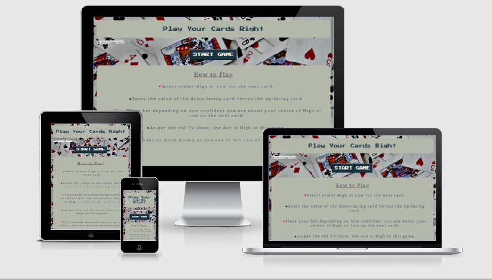
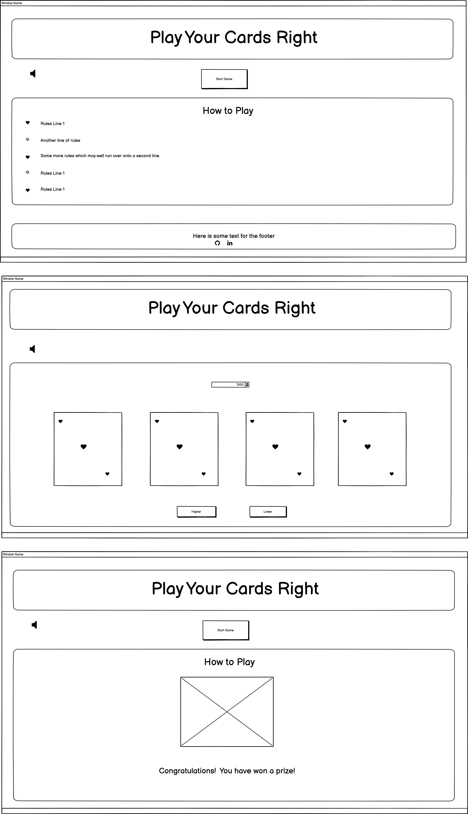

# Project 2 - Play Your Cards Right, a JavaScript game.

** **

|  |
|:--:|
| <b>Play Your Cards Right Game displayed on different devices.</b>|
| <b>Created using Amiresponsive. Please see [Technologies Used](#technologies-used) for details.</b>|

## [The live version of the website can be found here](https://kat632.github.io/P2-Play-Your-Cards-Right/).

** **
## **Table of Contents**

** **

*   [Overview](#overview)
*   [UX](#ux)
*   [Design](#design)
*   [Features](#features)
*   [Testing](#testing)
*   [Technologies Used](#technologies-used)
*	[Resources](#resources)
*   [Deployment](#deployment)
*   [Credits](#credits)
*   [Acknowledgements](#acknowledgements)
*   [Support](#support)

** **

## **Overview**

** **
 
This is the second Project for the **Full Stack Web Development Diploma** from [Code Institute](https://codeinstitute.net).

**Background to the project and why I decided to build this particular game**

Imagine if you will, it's 1986-ish, and an 8 year old girl sitting bored in her bedroom.  She starts flicking through some random books that have been left next to the family computer, the Acorn Electron.  Her dad got all the books when he bought the Acorn second-hand off his mate.  No one ever looks at the books though.  They're just there gathering dust.

The little girl opens up one of the books and discovers a whole world of computer manipulation inside.  She doesn't know what any of it means, but by looking at the pictures, she realised that the computer can do all sorts of interesting things that she'd not seen it do before.  This is how I started coding.

One of the programs in the book was to code a basic Higher or Lower card game which I can distinctly remember doing.  I have no memory at all of debugging it, so either it worked first time or I sat an went through it line by line, character by character looking for mistakes!

Incidentally, there was an official Play Your Cards Right game for the Acorn Electron.  [Please see here.](http://www.acornelectron.co.uk/eug/revs/britannia/Play_Your_Cards_Right_000.html).

|  |
|:--:|
| <b>8-year old me at Brownies in about 1986.  I'm the one with the glasses and blonde hair.</b>|

This website has been built using the knowledge gained from the HTML, CSS and JavaScript modules of Code Institute's FullStack Web Development course.  Please see [Resources](#resources) section for further information.

** **

|  |
|:--:|
| <b>Screenshot of the game play.</b>|

|  |
|:--:|
| <b>Screenshot displaying one of the prizes.</b>|

** **

[Return to Table of Contents](#table-of-contents)

** **

## **UX**

** **

**1. Strategy**

To ensure the UX is simple and user-friendly, by providing easy navigation through all pages on the site.

### **User stories**

**User Goals**

*	The site's users want to understand how to play the game.
*	The site’s users want to play an online game that has elements of chance.
*	The site's users want to play a game that can potentially have a different outcome every time they play it.

**Site Owner Goals**

*	The site’s goal is to provide a challenging game with the ability to "win" money and prizes, just like on the old TV programme.

Potential features to include:

*	Betting functionality.
*	The ability to go bust.
*	The ability to win a prize based on the final score.

**2. Scope**

*	To create a fluid and responsive layout for ease of use on common devices.

*	To fine-tune and implement the skills I have learnt so far on my course.

*	To provide a visually pleasing retro game environment to entertain the user.

**3. Structure**

I designed this website to have a retro look since, as stated previously, it is based loosely around the old 1980s TV show and computer game.

I wanted the layout to be visually simple.

**4. Skeleton**

*	Wireframes - please see below in the Design section.

*	Fixed footer for the purpose of always displaying the author of the game to the user.

*	Fixed header for the purpose of displaying the name of the game to the user.

*	Play area in the middle of the screen that displays the various elements of the game.

*	Sound toggle button and game play buttons are always in the same place.

**5. Surface**

Please see Design section below.

** **

[Return to Table of Contents](#table-of-contents)

** **

## **Design**

** **

### **Colour Scheme**

I used [**Coolors**](https://coolors.co/) to generate a suitably retro-looking colour scheme and then modified it for my own purposes.  The background colour #B4B8AB reminds me of the plastic on the CRT monitors that were around at the time.  The pink colour #8E4A49, used on one of the buttons, reminds me of the carpet in the bathroom(!) at my parents' house during the 1980s.

I used EightShapes Contrast Grid to test the foreground and background colour combinations for minimum contrast compliance.

|  |
|:--:|
| <b>EightShapes Contrast Grid displaying the colours in the game.</b>|
| <b>Please see [Technologies Used](#technologies-used) for details.</b>|

### **Typography**

The website uses two fonts throughout.  The header and buttons throughout the website are using the [**Press2P Start**](https://fonts.google.com/specimen/Press+Start+2P) font while the main text is using the [**Tienne**](https://fonts.google.com/specimen/Tienne#standard-styles) font.  Both fonts are from [Google Fonts](https://fonts.google.com/).  

I chose **Press 2P Start** because I had used it previously in the [**Code Institute**](https://codeinstitute.net/) Retro Hackathon in August 2021.  I like its retro 1980s feel, even though it is based on the Namco arcade game fonts of the time and therefore nothing to do with the Acorn Electron.

I chose **Tienne** because it reminds me of the original font from the opening screen of the British TV Show Play Your Cards Right.  [This is a link to a Google image search of the TV show](https://tinyurl.com/nxxx6unj).

### **Imagery**

*	The background is by [Amanda Jones](https://unsplash.com/@amandagraphc) on Unsplash.  I chose it because it represents the game.

*	The fountain pen is by [Shutterbug75](https://pixabay.com/users/shutterbug75-2077322/) on Pixabay.  I chose it because the consolation prizes on 1980s British TV shows were generally something rubbish, like a clock or a pen.  See this [Metro](https://metro.co.uk/2015/03/10/bullys-special-prize-why-game-shows-were-better-in-the-70s-and-80s-5050086/) article I used for inspiration.

*	The Casio watch photo was taken by my husband, [Chris Morley](https://www.linkedin.com/in/chris-morley-11620815/) and it is from his collection of 1980s technology.  A digital watch was considered the height of geeky sophistication at the time and are still considered a quintessential part of 1980s design today.

*	The speedboat image was taken by [Anthony Formin](https://unsplash.com/@aginsbrook) and I chose it because it is an old-looking speedboat with a family in it.  Speedboats were often given away as prizes on game shows in the 1980s.  It was always a source of amusement to my family that Barry from Wigan would be parking a speedboat outside his two-bedroomed terraced house.  I felt that this paticular boat represented the look and feel of family-oriented game shows of the time.  I originally had a fancier boat, but it felt too modern.

*	The cruise photo is by [Alonso Reyes](https://unsplash.com/@alonsoreyes) on Unsplash.  I chose to have a world cruise as one of the prizes because people did win luxury holidays on the quiz shows of the time.

* The image of the Mini car is from [Wikipedia](https://en.wikipedia.org/wiki/Mini).  I chose it because I watched the very first episode of [Play Your Cards Right on YouTube](https://www.youtube.com/watch?v=t4jW_OGwXus) and the star prize was a Mini.

### **Wireframes**

|  |
|:--:|
| <b>Play Your Cards Right wireframes in a mobile portrait orientation.</b>|
| <b>Created using Balsamiq. Please see [Technologies Used](#technologies-used) for details.</b>|

|  |
|:--:|
| <b>Play Your Cards Right wireframes in a tablet landscape orientation.</b>|
| <b>Created using Balsamiq. Please see [Technologies Used](#technologies-used) for details.</b>|

|  |
|:--:|
| <b>Play Your Cards Right wireframes viewed on a computer screen.</b>|
| <b>Created using Balsamiq. Please see [Technologies Used](#technologies-used) for details.</b>|

### **Differences to Design**

*   I decided to leave the footer at the bottom of the page during game play.  It looks neater and it provides the user with the name and social links of the author of the game at all times.

*   I was going to have the cards overlapping on smaller screen sizes, but in the end I decided it was going to be quicker to let them just be side by side, like on all other screen sizes.

### **Limitations**

** **

[Return to Table of Contents](#table-of-contents)

** **

## **Features**

** **

Interactivity for users.
Betting feature.

*   

**Responsive features**

*	Responsive on all device sizes.

*	Media queries to change the size of the cards depending on the screen size of the device on which the game is being played.

**Features Left to Implement**

** **

[Return to Table of Contents](#table-of-contents)

** **

## **Testing**

** **

## **Functionality Testing**

I used Mozilla Web Developer Tools and Chrome Developer Tools throughout the project for testing and solving problems with responsiveness and style issues.

## **Compatibility Testing**

The site has been tested across multiple virtual devices and browsers using developer tools.  Browser testing on Safari, Edge, Firefox and Chrome.

The site has been tested across multiple non-virtual devices, including iPhone 8 and iPad Mini 2.

## **Performance testing**

All pages pass through [Google Lighthouse](https://developers.google.com/web/tools/lighthouse) with a score of 94 for performance and no major concerns.

## **Accessibility Testing**

Accessibility testing using [WebAim Wave - Web Acessibility Evaluation Tool](https://wave.webaim.org/)

## **Code Validation**

Testing has been carried out using the following web services:

HTML on all pages validated using [The W3C Markup Validation Service](https://validator.w3.org/)

CSS validated using [The W3C CSS Validation Service](http://jigsaw.w3.org/css-validator/)

JavaScript code has been validated using [JSHint](https://jshint.com/)

## **Code Validation Issues**

When validating the HTML code, an issue was revealed in that you cannot have a type="" in an audio tag.  This has now been removed.

## **Peer Code Review**

At the suggestion of my mentor I submitted my code for Peer Code Review in the **Code Institute** Slack channel.  Please see the names of the reviewers below in [Acknowledgements](#acknowledgements).

The results were:
*	
*	
*	

## **User Testing**

**Visitor Goals**

> As a website visitor, I want to easily understand the main purpose of the website and learn more about the organisation.
>
>> The name of the business and what the company does is evident on the home page.  The different sections on the home page provide more opportunity to learn about the organisation.

> As a website visitor, I want to be able to easily navigate through the site to find content.
>
>> Each page has a navigation bar at the top allowing the user to navigate between the pages.  Since the home page is longer than the others, a back-to-top button has been included to allow the user to quickly get back to the top of the page where the navigation bar is.

> As a website visitor, I want to be able to view the website clearly on any mobile device.
>
>> The website is responsive at different screen widths.  For a description of the responsive features, please see [Features](#features).

> As a website visitor, I want to know what services are provided by the organisation.
>
>> The Planning and Tactics pages provide information about the services provided by Rapier Marketing.

> As a website visitor, I would like to see examples of previous projects undertaken by the organisation.
>
>> The Past Projects and Testimonials sections on the home page provide information about what the organisation has previously undertaken.

** **

[Return to Table of Contents](#table-of-contents)

** **

## **Technologies Used**

** **

*	[HTML](https://en.wikipedia.org/wiki/HTML) - This project uses HTML as the main language used to complete the structure of the website.

*	[CSS](https://www.w3.org/Style/CSS/Overview.en.html) - This project uses custom written CSS to style the website.

*   [JavaScript](https://www.javascript.com/) - This project uses JavaScript to dynamically updated the content of the web page based on the interactions of the user.

*	[Font Awesome](https://fontawesome.com/) - Font awesome Icons are used for the What We Do information boxes on the home page and the social media links contained in the Footer section of the website.

*   [Google Fonts](https://fonts.google.com/) - Google fonts are used throughout the project to import the fonts.

*   [Google Chrome Developer Tools](https://developers.google.com/web/tools/chrome-devtools) - Google Chrome's built in developer tools are used to inspect page elements and help debug issues with the site layout and test different CSS styles.

*   [Firefox Developer Tools](https://developer.mozilla.org/en-US/docs/Tools) - Firefox Developer Tools have been used throughout the projects for testing and debugging code.

*   [balsamiq Wireframes](https://balsamiq.com/wireframes/) - This was used to create wireframes for 'The Skeleton Plane' stage of UX design.

*   [MS PAINT](https://support.microsoft.com/en-us/windows/get-microsoft-paint-a6b9578c-ed1c-5b09-0699-4ed8115f9aa9) - For cropping and resizing images.

*   [Favicon](https://favicon.io/) - Favicon.io was used to make the site favicon.

*   [AmIReponsive](http://ami.responsivedesign.is/) - This was used to make the multi device mockup in the README.

*   [TinyPNG](https://tinypng.com/) - Used for all images to cut back the size of .png files.

*	[TinyURL](https://tinyurl.com/app/) - Used to shorten a URL in this readme document.

** **

[Return to Table of Contents](#table-of-contents)

** **

## **Resources**

** **

*	The basic structure of this project was built using this course on [Udemy](https://www.udemy.com/course/javascript-card-game/).  I did not feel confident enough about my JavaScript skills to build what I wanted to build from scratch after I finished the lessons leading up to this project.  However, I feel the project I have built is sufficiently different from the one on Udemy to be able to submit it.  I have styled the project, added the functions for the sound and for the prizes by myself.  As a result, I feel like my understanding of JavaScript has greatly improved through doing the Udemy course to build the basic structure of the game and through building up my project into a visually attractive and fun game to play.

*	In making the toggle sound on/off, this was the resource that finally helped me make it work [Stack Overflow](https://stackoverflow.com/questions/39041960/how-to-unmute-html5-video-with-a-muted-prop)

*	W3 Schools

*	https://developer.mozilla.org/en-US/

** **

[Return to Table of Contents](#table-of-contents)

** **

## **Deployment**

** **

GitPod was used to write all code in this repository and pushed via Git to GitHub.

**Using Git Hub Pages**

*   Navigate to the gitHub [Repository]():
*	Click the 'Settings' Tab.
*	Scroll down to the GitHub Pages heading.
*	Click the Save button.
*	Click the link to go to the live deployed page.

**Run Locally**

*   Navigate to the GitHub Repository:
*	Click the Code drop down menu.
*	Either Download the ZIP file, unpackage locally and open with IDE (This route ends here) OR Copy Git URL from the HTTPS dialogue box.
*	Open your developement editor of choice and open a terminal window in a directory of your choice.
*	Use the 'git clone' command in terminal followed by the copied git URL.
*	A clone of the project will be created locally on your machine.

** **

[Return to Table of Contents](#table-of-contents)

** **

## **Credits**

** **

### **Media**

*  Sound effects obtained from [Zapsplat] https://www.zapsplat.com
*   
*  Images from Pexels, Unsplash, PIxabay and Wikipedia.  Please see .... for details of the individual images.
 
### **Content**

*   

### **Code Snippets**

*	Retro button styling from this Code pen by Brandon Stoyles https://codepen.io/Brandon-Stoyles/pen/RajYmd

*	List styling idea from this blog article https://love2dev.com/blog/customize-bulleted-list/

* 
	  
** **

[Return to Table of Contents](#table-of-contents)

** **

## **Acknowledgements**

** **

I would like to thank:

*	My mentor [Adegbenga Adeye](https://github.com/deye9) for his enthusiasm, support, knowledge and excellent suggestions.

*	Sean from **Code Institute** Tutor Support who helped me with the media queries for the cards.	

*   

*	

*	

** **

[Return to Table of Contents](#table-of-contents)

** **

## **Support**

** **

If you require any help or assistance you may contact me on 

katherine.biggs@mail.com